```
import pandas as pd
import numpy as np
import seaborn as sns
from matplotlib import pyplot as plt
import plotly.express as px
import plotly.graph_objects as go

# importing dataset
heart_data = pd.read_csv("./heart-disease-prediction/heart_2020_cleaned.csv")

# Renaming Columns as Format: Capitalized First Letter & Spaces Between Words
for col in heart_data.columns.values:
    new_col = col
    for c in col:
        if c == c.capitalize() and col != "BMI" and c != col[0]:
            new_col = col.replace(c, (" " + c))

    heart_data = heart_data.rename(columns = {col : new_col})

heart_data = heart_data.rename(columns = {"Diff Walking" : "Difficulty Walking"})
heart_data = heart_data.rename(columns = {"Gen Health" : "General Health"})

# replacing borderline diabetes w/no and pregnancy w/yes
diabetes = heart_data.Diabetic.values.tolist()
updatedDiabetes= []

for i in (diabetes):
    if i == "No, borderline diabetes":
        updatedDiabetes.append("No")

    elif i == "Yes (during pregnancy)":
        updatedDiabetes.append("Yes")

    elif i == "Yes":
        updatedDiabetes.append("Yes")

    else:
        updatedDiabetes.append("No")

diabetes = updatedDiabetes

# replacing the original column with new values
heart_data["Diabetic"] = diabetes

# Diabetic and non-diabetic datasets

diabetes_data = heart_data.loc[heart_data["Diabetic"] == "Yes"]
diabetes_per = 100 * (len(diabetes_data)/319795)
for count in range(len(diabetes_data)):
    diabetes_data.index.values[count] = count
    count += 1

nondiabetic_data = heart_data.loc[heart_data["Diabetic"] == "No"]
nondiabetic_per = 100 * (len(diabetes_data)/319795)
for count in range(len(diabetes_data)):
    diabetes_data.index.values[count] = count
    count += 1

# List of all individuals with Heart Disease
heart_data1 = heart_data[heart_data["Heart Disease"] == "Yes"]

    
#List of all individuals without Heart Disease
heart_data2 = heart_data[heart_data["Heart Disease"] == "No"]


# Alcohol and Non-alcohol Datasets
alcohol_data = heart_data.loc[(heart_data['Alcohol Drinking'] == "Yes")]
for count in range(len(alcohol_data)):
    alcohol_data.index.values[count] = count
    count += 1

no_alcohol_data = heart_data.loc[(heart_data['Alcohol Drinking'] == "No")]
for count in range(len(no_alcohol_data)):
    no_alcohol_data.index.values[count] = count
    count += 1
    
# Smoker and Non-Smoker Datasets

smoker_data = heart_data.loc[heart_data["Smoking"] == "Yes"]
smoker_per = 100 * (len(smoker_data)/319795)
count = 0
while count < len(smoker_data.index.values):
    smoker_data.index.values[count] = count
    count += 1

nonsmoker_data = heart_data.loc[heart_data["Smoking"] == "No"]
nonsmoker_per = 100 * (len(nonsmoker_data)/319795)
count = 0
while count < len(nonsmoker_data.index.values):
    nonsmoker_data.index.values[count] = count
    count += 1
```

## Exploring Data


```
#Physical Activity by Ages
plt.figure(figsize=(16,12))
#sns.heatmap(data=heart_data.iloc[:,:].corr(),annot=True,fmt='.2f',cmap='coolwarm')
sns.lineplot(data=heart_data,x="Age Category",y="Physical Activity", color='red')
g=sns.lineplot(data=heart_data,x="Age Category",y="Physical Activity",sort=True, color='red')

g.set_xticklabels(['18-24','25-29','30-34','35-39','40-44','45-49','50-54','55-59','60-64','65-69','70-74','75-79','80 or older'])
plt.title("Physical Activity by Ages")
plt.show()
```


    
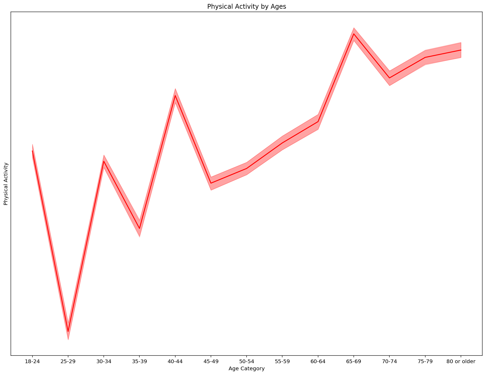
    


##### This graph shows that as you grow older, your physical activity (not counting daily work) increases. Given that heart disease is most common in people of ages 65 and older, it can be inferred that older people exercise more regularly in order to prevent the risk of heart disease.  


```
my_list = [7.5526509169936995, 6.717428352538345, 9.714035554026799, 10.679028752794759, 10.533623102299911, 9.305023530699355, 7.936959614753201, 6.814052752544599, 6.568582998483404, 6.425991650901358, 5.86406916931159, 5.301833987398177,
6.586719617254804]
my_list.reverse()
my_list1 =['18-24','25-29','30-34','35-39','40-44','45-49','50-54','55-59','60-64','65-69','70-74','75-79','80 or older']
plt.figure(figsize=(16,12))
#sns.heatmap(data=heart_data.iloc[:,:].corr(),annot=True,fmt='.2f',cmap='coolwarm')
sns.barplot(data=heart_data,x=my_list1,y=my_list)
plt.xlabel("Age Category")
plt.ylabel("Percentage of Age Group")
plt.title("Age Groups Surveyed")
plt.show()
```


    
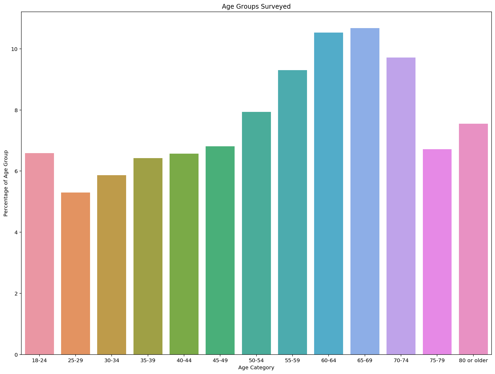
    


##### This graph summarizes the percentage of people from each age group that were surveyed for this dataset. As shown, younger age groups are less represented than older groups, which prevents us from seeing more of the effects of environment and lifestyle relating to heart disease on the younger generation. Just because there is a lack of information on younger people does not mean that they are not at risk of contracting heart disease. Everyone must take care of their own health.


```
plt.figure(figsize=(16,12))
sns.lineplot(data=heart_data,x="Mental Health" ,y="Physical Health", color='red')
plt.xlabel("Mental Health")
plt.ylabel("Physical Health")
plt.title("Mental Health vs. Physical Health")
plt.show()
```


    
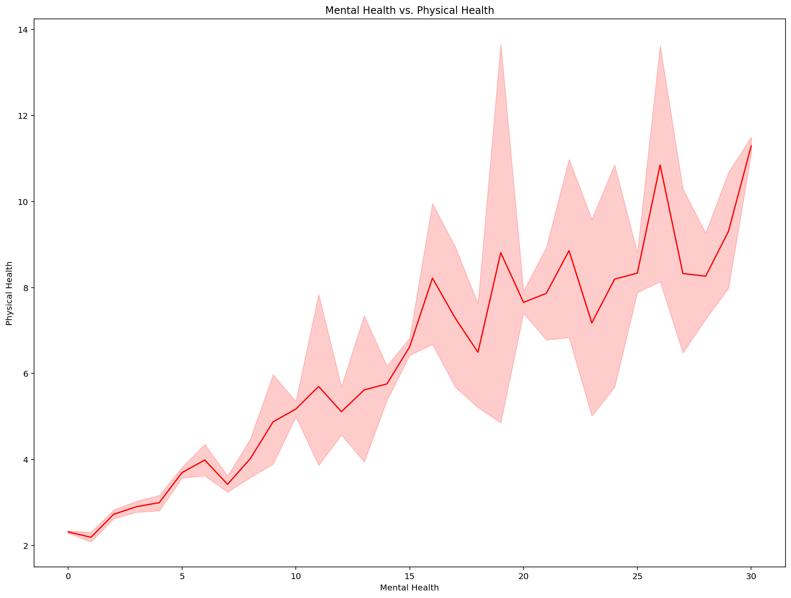
    


##### This graph shows the close relationship between mental and physical health. Both increase and decrease together. This information suggests that the causes of mental and physical health may be similar, which could also mean that treatments could be similar as well.  

#

### Summary: The representation of people surveyed is unequal, but the data shows many important and accurate trends, which makes it worth exploring.


#

#

## How Heart Disease Can Affect Your Life


```
# Physical and mental health w/ heart disease
plt.figure(figsize=(16,12))
sns.lineplot(data=heart_data,x="Physical Health",y="Mental Health",hue="Heart Disease")
plt.title("Physical Health and Mental Health For People With and Without Heart Disease")
plt.show()

```


    
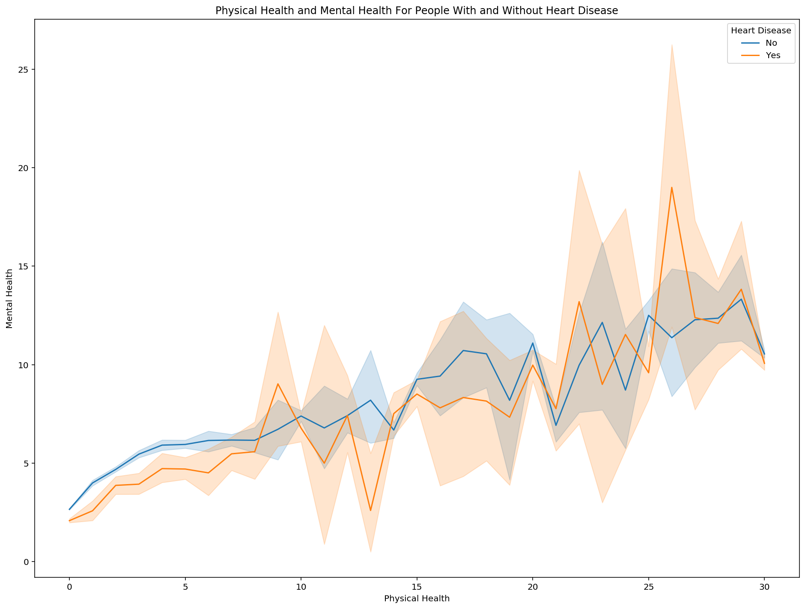
    


##### Physical Health is described as how many days in the past 30 days were they ill or injured.  People that have heart disease have lower Mental Health but still, have good Physical Health.  Those who do not have heart disease have a higher Mental Health but have a lower Physical Health.  Avoiding Heart Disease is key to having good Mental and Physical Health.  Having good Physical Health can lead to better Mental Health.


```
# Heart disease and BMI
plt.figure(figsize=(16,12))
colors = sns.color_palette('pastel')[2:4]
sns.barplot(data=heart_data,x="Heart Disease",y="BMI", palette = colors)
plt.ylabel("Average BMI")
plt.title("Heart Disease and Average BMI")
plt.show()

```


    
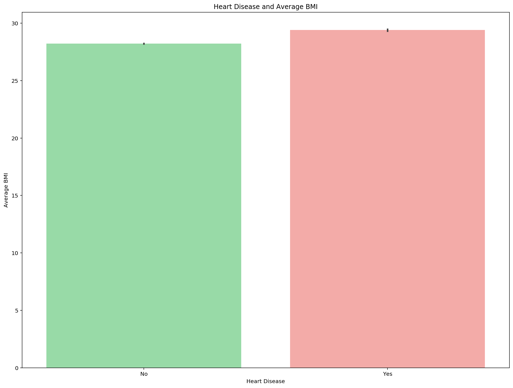
    


##### People that have a higher BMI are more at risk of getting heart disease than people with a lower BMI.  Maintaining a low BMI is essential to preventing heart disease.  


```
# Average BMI of Each Age Group
BMI_avg = [0, 0, 0, 0, 0, 0, 0, 0, 0, 0, 0, 0, 0]

i = 0
for age in my_list1:
    count = 0
    for BMI in heart_data.loc[heart_data["Age Category"] == age]["BMI"]:
        BMI_avg[i] += BMI
        count += 1
    BMI_avg[i] /= count
    i += 1

plt.figure(figsize=(16,12))
#sns.heatmap(data=heart_data.iloc[:,:].corr(),annot=True,fmt='.2f',cmap='coolwarm')
sns.barplot(data=heart_data,x=my_list1,y=BMI_avg)
plt.xlabel("Age Category")
plt.ylabel("Average BMI")
plt.title("Average BMI of Each Age Group")
plt.show()
```


    
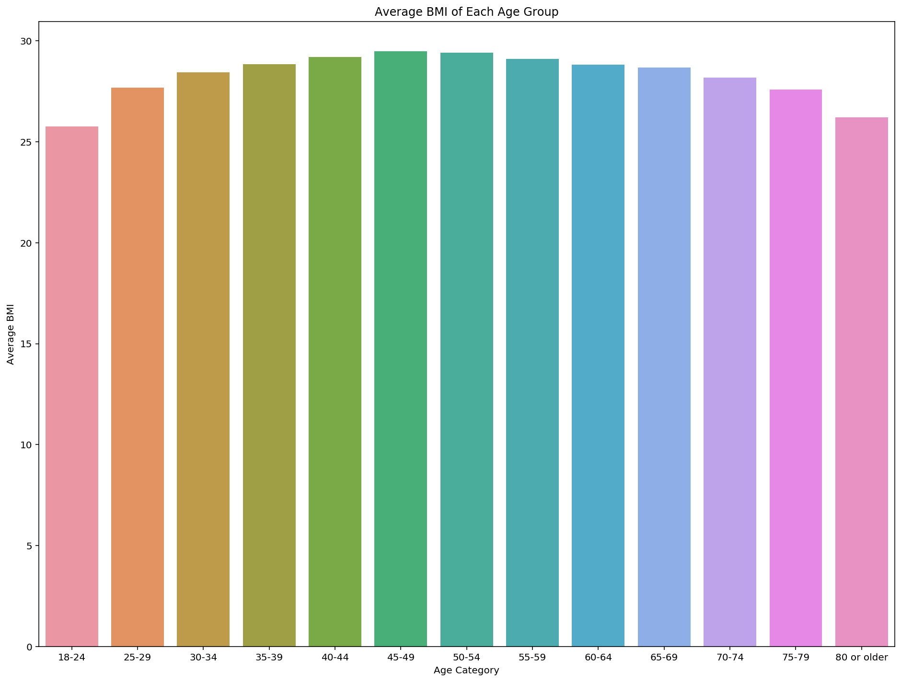
    


##### This bar chart is showing the average Body Mass Index \(BMI\) for each Age Category.  A healthy BMI is between 18.5 to 24.9. The ages where the BMI is the highest is when most people are in the workforce and do not have as much time to exercise to reduce their BMI.  As they get older and are retired, they have more time to exercise and reduce their BMI. 


#

#### As you can see from the above charts, having a high BMI increases the chances of you getting heart disease.


#


```

percentage = [100 * (8957/27400),100-(100 * (8957/27400))]
yes_no = ["Yes", "No"]

plt.figure(figsize=(16,12))
colors = sns.color_palette('pastel')[5:7]
sns.barplot(data=diabetes_data,x=yes_no ,y=percentage,palette = colors)
plt.xlabel("Diabetic")
plt.ylabel("Percentage of Having Heart Disease")
plt.title('Diabetes and Heart Disease')

plt.show()
```


    
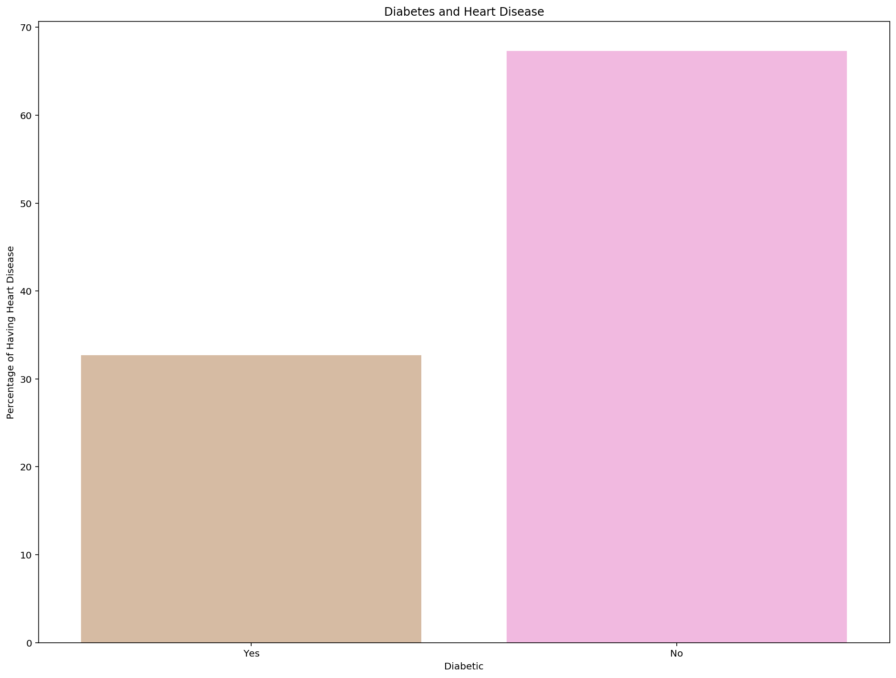
    


##### This bar graph represents the amount of people with and without diabetes that have heart disease. As shown, the number of people who have diabetes and heart disease is much less than those who have don't have diabetes but have heart disease, suggesting that there isn't much correlation between the two conditions. In this dataset, 9% , or about 27.4 thousand were found to have heart disease, and about 13%, or 43.3 thousand people in this dataset were found to have diabetes. Within the whole population, about 9 thousand people out of the 320 thousand people in the dataset have both diabetes and heart disease.  


```
#Heart disease and mental health
plt.figure(figsize=(16,12))
colors = sns.color_palette('pastel')[5:7]
sns.barplot(data=heart_data,x="Heart Disease",y="Mental Health", palette = colors)
plt.title("Heart Disease and Mental Health")
plt.show()


```


    
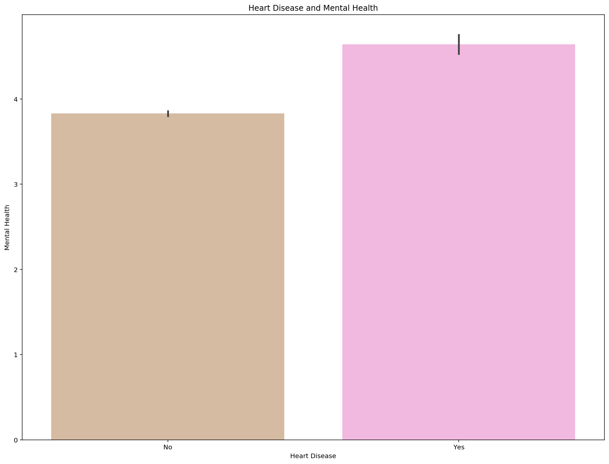
    


##### This visual shows the number of days  that people with and without heart disease had poor mental health in 30 days. As seen, those who have heart disease tend to experience more days where their mental health is not good. 


```
# Heart disease and physical health
plt.figure(figsize=(16,12))
colors = sns.color_palette('pastel')[5:7]
sns.barplot(data=heart_data,x="Heart Disease",y="Physical Health", palette = colors)
plt.title("Heart Disease and Physical Health")
plt.show()
```


    
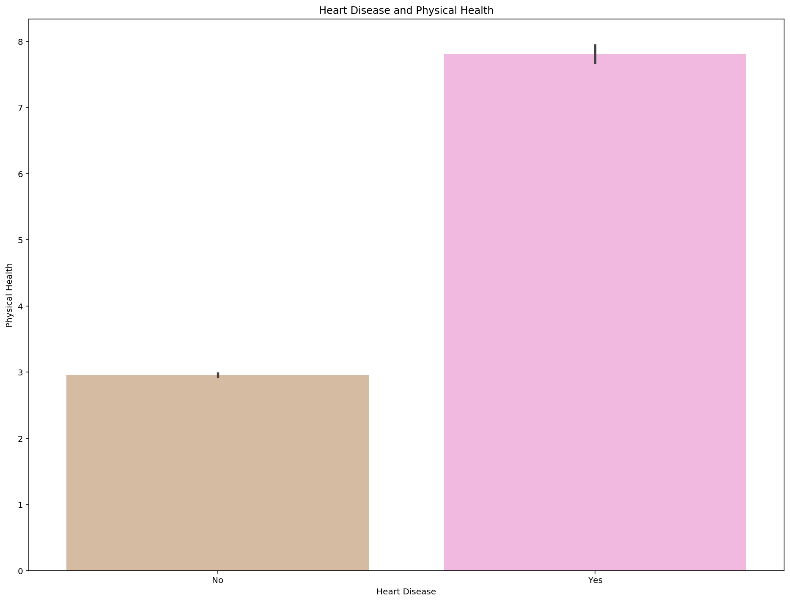
    


##### This visual represents the physical health people with and without heart disease have. The physical health of a person is measured by the number of days in the past 30 where the person felt that they weren't in good physical health. This graph shows that people with heart disease tend to have worse physical health as compared to those who don't. 


```
#Heart disease and sleep time
plt.figure(figsize=(16,12))
colors = sns.color_palette('pastel')[0:2]
sns.barplot(data=heart_data,x="Heart Disease",y="Sleep Time", palette = colors)
plt.title("Heart Disease and Sleep Time")
plt.show()
```


    
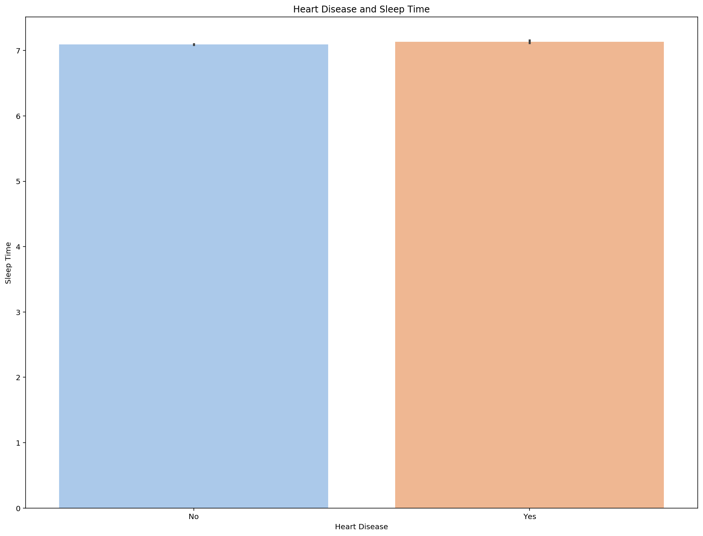
    


##### This visual represents the amount of sleep that people with and without heart disease get. Since, the value is the same, this visual shows that there isn't a significant difference between the amount of sleep that people with and without heart disease get. This visual also shows us that the average amount of sleep for people is about 7 hours. 


#

#

## Smoking and Heart Disease


```
data = [58.59, 41.41]
labels = ["Smokers", "Non-Smokers"]

colors = sns.color_palette('pastel')[0:2]
plt.pie(data, labels = labels, colors = colors, autopct='%.0f%%')
plt.title("Percentage of Smokers in people with Heart Disease")
plt.show()
```


    
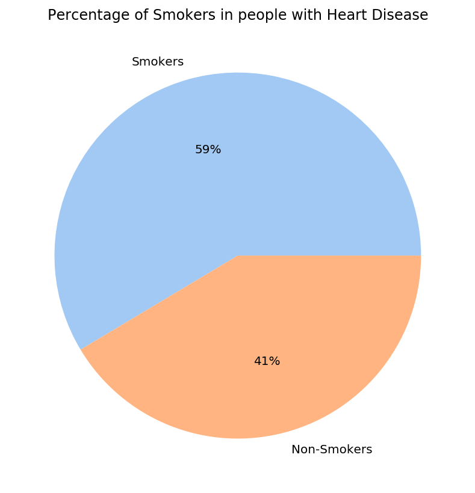
    


##### This pie chart shows the percentage of people <u>with</u> Heart Disease who are smokers and non\-smokers. The chart shows that the majority of people with Heart Disease are smokers meaning smoking may have negative effects on a person's health that could lead to a higher risk of Heart Disease.


```
data = [39.62, 60.38]
labels = ["Smokers", "Non_Smokers"]

colors = sns.color_palette('pastel')[0:2]
plt.pie(data, labels = labels, colors = colors, autopct='%.0f%%')
plt.title("Percentage of Smokers in people without Heart Disease")
plt.show()
```


    
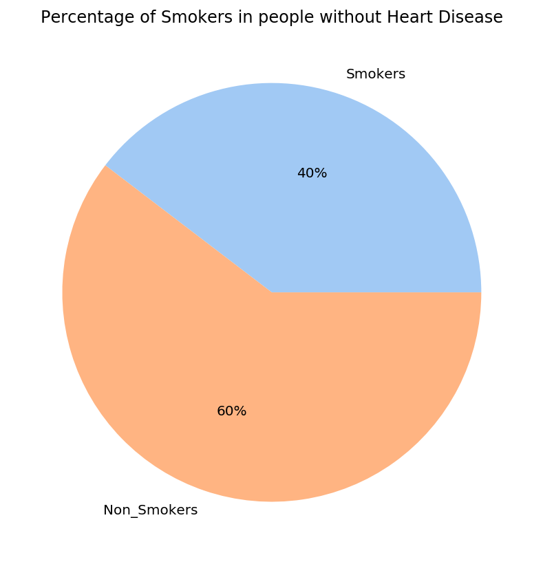
    


##### This pie chart shows the percentage of people <u>without</u> Heart Disease who are smokers and non\-smokers. A majority of people without Heart Disease are non\-smokers and combined with the earlier pie chart shows that smoking would have a definite impact on the chances of Heart Disease.


##


### With the data showing a clear correlation between smoking and a higher risk of Heart Disease, people should now consider all the health problems already associated with smoking and add on the higher risk of Heart Disease, before deciding to smoke.


#

#

## Alcohol and its Effects on Heart Disease


```
data = [4.17, 95.83]
labels = ["Alcoholics", "Non-Alcoholics"]

colors = sns.color_palette('pastel')[2:4]
plt.pie(data, labels = labels, colors = colors, autopct='%.0f%%')
plt.title("Percentage of People with Heart Disease that are Alcoholic VS Non-Alcoholic")
plt.show()
```


    
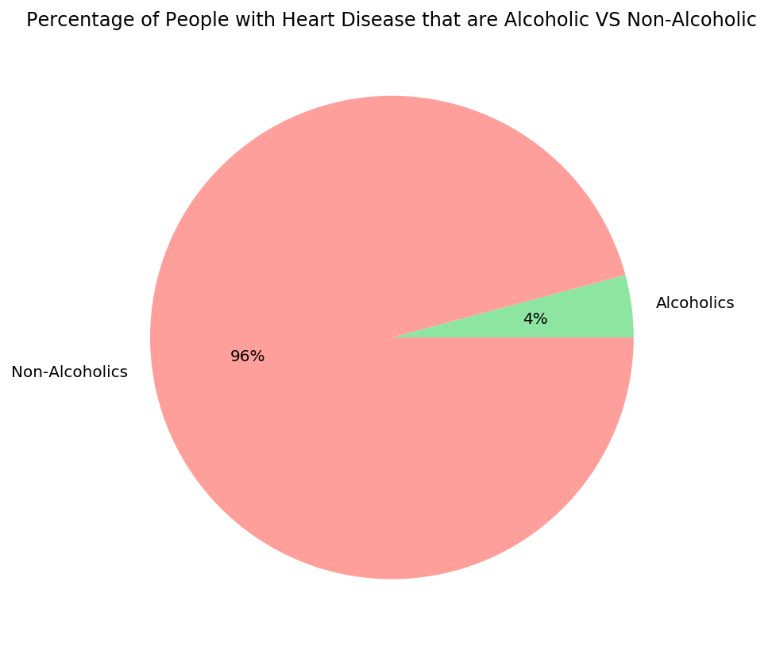
    


##### The chart depicts people within the dataset that have heart disease. Of those people with heart disease, 4% are alcoholic.


```
data = [7.06, 92.94]
labels = ["Alcoholic", "Non-Alcoholic"]

colors = sns.color_palette('pastel')[2:4]
plt.pie(data, labels = labels, colors = colors, autopct='%.0f%%')
plt.title("Percentage of People with Heart Disease that are Alcoholic VS Non-Alcoholic")
plt.show()
```


    
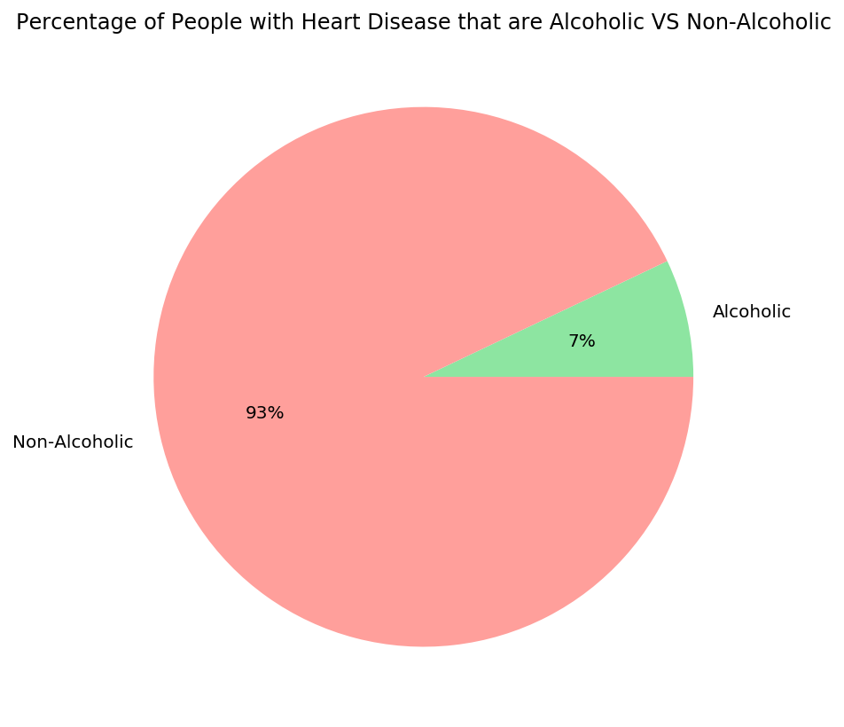
    


##### This chart depicts people within the dataset that do not have heart disease. Of those people, 7% are alcoholic.


### By observing the first chart, it can be inferred that alcohol does not have a direct effect on a person's chance to have heart disease, as an overwhelming majority that do have heart disease are not heavy drinkers. However, the second chart demonstrates that of those without heart disease, very are not heavy drinkers either. Essentially, there is an imbalance of collected data on alcoholism, and its effects on heart disease are uncertain.


### Although the presented data depicts otherwise, it is a scientific consensus that heavy drinking can lead to heart failure. The Centers for Disease Control and Prevention \(CDC\) states that heavy drinking can lead to cardiovascular problems such as increased blood pressure and heart disease.


#
